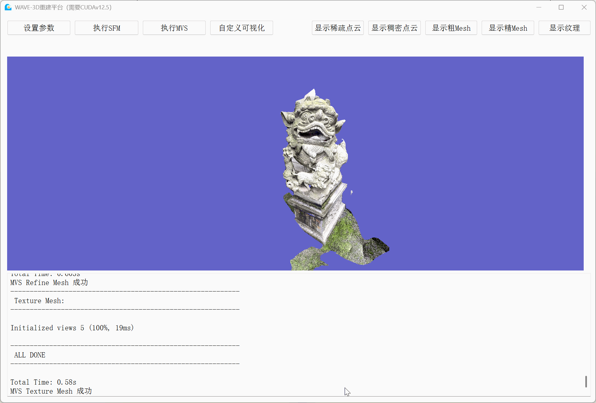
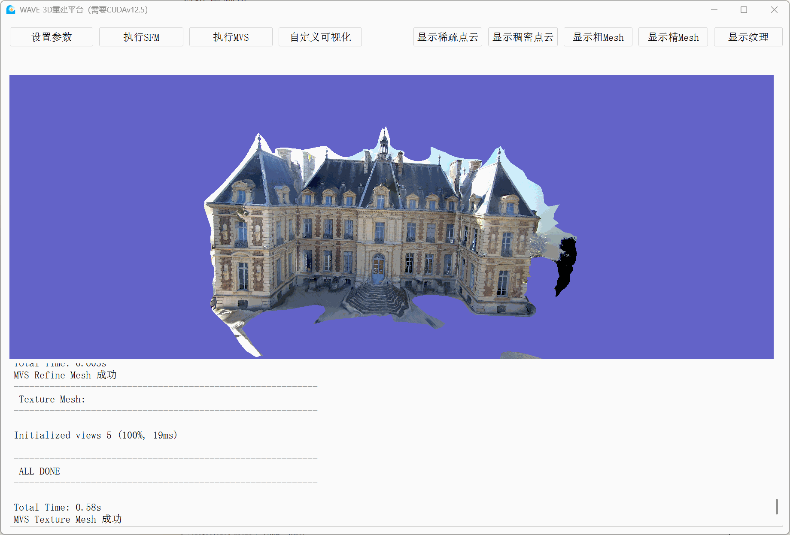
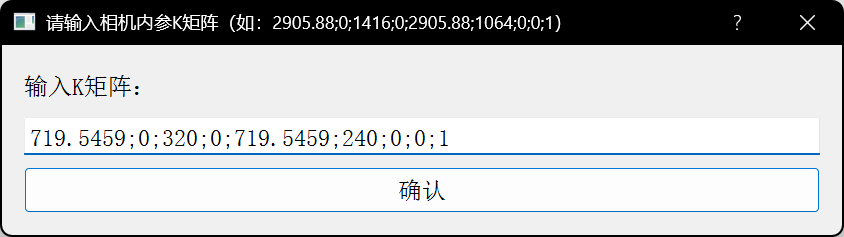
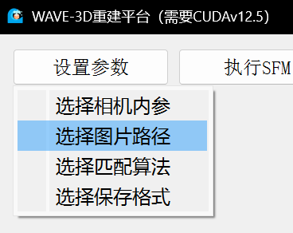
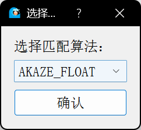
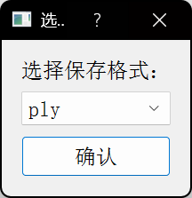
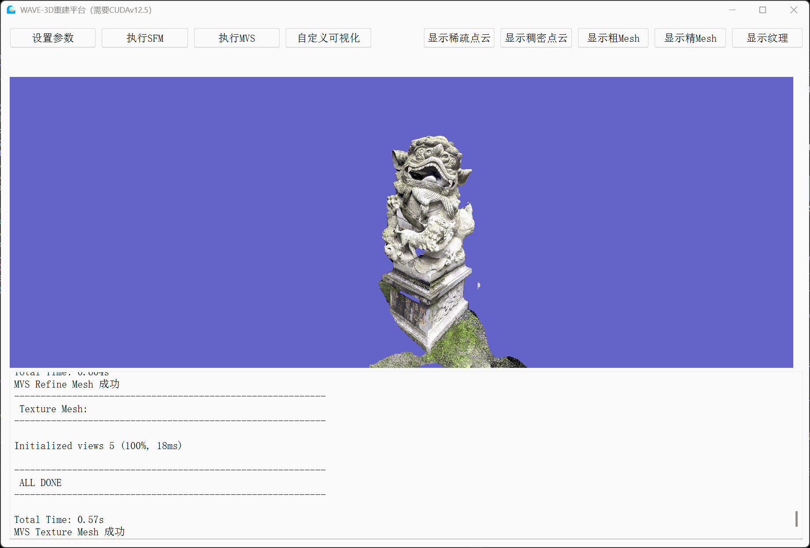
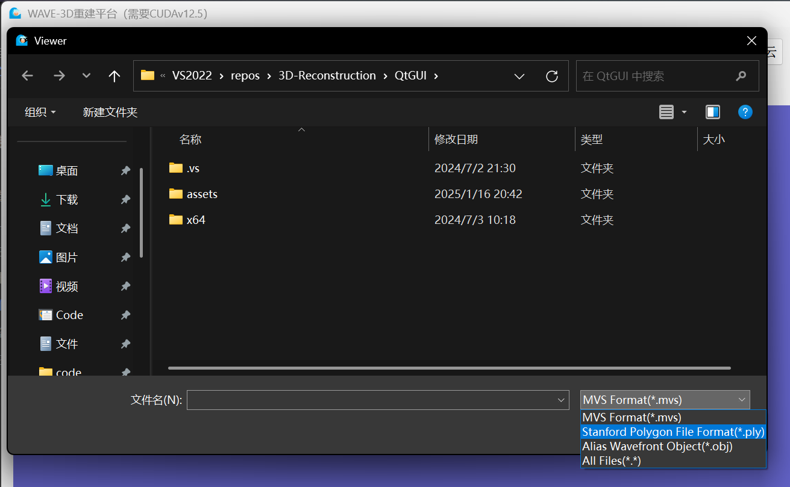

<h1 align="center">
  
   
  WAVE-3D Reconstruction
   
</h1>

<h3 align="center">
 Windows 上基于 <a href="https://github.com/openMVG/openMVG">OpenMVG</a> + <a href="https://github.com/cdcseacave/openMVS">OpenMVS</a> 的3D重建平台
</h3>

## 1 Preview

平台运行效果的简短视频：

https://github.com/user-attachments/assets/5714ac91-e7e6-47ac-973b-e31a2a9831a5

## 2 Introduction

#### 精简与融合

- **性能优化**：通过裁剪和封装 OpenMVG+OpenMVS代码，优化性能，减少冗余计算，提升重建效率。
- **完整流程**：融合 OpenMVG (SfM) 和 OpenMVS (MVS) 流程，提供从 SfM 到 Mesh 生成的完整解决方案。

#### 可视化应用

- 基于 **Qt5 框架** 的桌面应用，直观、易用的操作界面让用户轻松完成三维重建任务。

#### 数据集测试

测试了多种外部数据集：

1. **树莓派拍摄数据集**（如预览中的砖块场景）

2. **手机拍摄的自定义数据**（如校图书馆的石狮子模型）

   

3. 开源数据集：

   - [COLMAP South Building](https://demuc.de/colmap/datasets/)

     

   - [OpenMVG SceauxCastle](https://github.com/openMVG/ImageDataset_SceauxCastle)

     

   - [DTU MVS Data Set–2014 set6](https://roboimagedata.compute.dtu.dk/?page_id=36)

     

   - [ETH3D Test data statue](https://www.eth3d.net/datasets#high-res-multi-view)

     

## 3 Requirements

- **CUDA 版本**：12.5（必须，否则在执行 MVS 时可能会闪退）
- **Windows 版本**：10 或 11
- **磁盘容量**：至少 500MB 可用空间
- **推荐显卡**：支持 CUDA 的 NVIDIA 显卡

## 4 Install

通过 MSI 安装

1. 下载 [Release](https://github.com/PLUS-WAVE/WAVE-3D-Reconstruction/releases/) 中 Latest 的安装包：`WAVE-3D-Recon.msi`
2. 运行安装包，并按照安装向导完成安装
3. 安装完成后，桌面会生成一个快捷方式 **WAVE-3D-Recon**，通过该快捷方式可以打开应用。也可以直接前往安装目录，运行 **QtGUI.exe** 打开应用

## 5 Build

本项目使用 VS2022 + Qt 5.15.2_msvc2019_64 为开发环境，除了 Qt 所有的外部库均使用 vcpkg 进行安装：

完整安装的库的列表请见 [vcpkg_list.txt](vcpkg_list.txt)

### 5.1 主要库

1. **Boost**
   - `boost-accumulators`, `boost-algorithm`, `boost-atomic`, `boost-filesystem`, `boost-thread` ……
2. **OpenCV**
   - `opencv4`, `opencv4[dnn]`, `opencv4[jpeg]`, `opencv4[png]`, `opencv4[tiff]`, `opencv4[webp]`
3. **Eigen3**
   - `eigen3`
4. **Ceres**
   - `ceres`, `ceres[cxsparse]`, `ceres[lapack]`, `ceres[suitesparse]`
5. **Qt**
   - `qt5-base`, `qt5-svg`
6. **OpenMVS**
   - `openmvs`, `openmvs[ceres]`, `openmvs[cuda]`, `openmvs[nonfree]`, `openmvs[openmp]`
7. **OpenMVG**
   - `openmvg`, `openmvg[openmp]`, `openmvg[software]`

### 5.2 其他库

1. **ceres**
   - `ceres`, `ceres[cxsparse]`, `ceres[lapack]`, `ceres[suitesparse]`
2. **lapack**
   - `lapack-reference`, `lapack-reference[blas-select]`, `lapack-reference[noblas]`
3. **suitesparse**
   - `suitesparse`
4. **libssh**
   - `libssh`
5. **sqlite3**
   - `sqlite3`, `sqlite3[json1]`

### 5.3 独立 SDK

> 将生成的包从已安装目录导出到独立的开发人员 SDK。
>
> `vcpkg export` 生成独立、可分发的 SDK（软件开发工具包），可在另一台计算机上使用而无需单独获取 vcpkg

下载 [Release](https://github.com/PLUS-WAVE/WAVE-3D-Reconstruction/releases/) 中的 vcpkg-export-20250116-214440.7z，解压后直接在解压的目录中运行命令：`./vcpkg.exe integrate install` 即可集成到 VS 中

## 6 Usage

### 6.1 设置参数

用户需要首先配置以下四个关键参数：

1. **配置相机内参**

   - 输入相机的 K 矩阵，格式如图所示：

     

2. **选择图片路径**

   - 从本地选择存放图片的文件夹（注意：**路径不能包含中文**）

     

3. **选择匹配算法**（可选）

   - 通过下拉菜单选择匹配算法，默认值为 `AKAZE_FLOAT`：

     

4. **选择保存格式**（可选）

   - 通过下拉菜单选择保存的文件格式，默认值为 `.ply`：

     

### 6.2 执行 SFM 和 MVS

1. **执行 SFM**
   - 点击“执行 SFM”，平台将开始生成稀疏点云，处理完成后会将结果显示在可视化窗口中
2. **执行 MVS**
   - 点击“执行 MVS”，系统将生成中间产物，包括稠密点云、粗 Mesh 和精细 Mesh，并输出最终带有贴图的 Mesh 模型

### 6.3 结果可视化（各环节产物）

- 用户可以通过各环节结果的可视化按键检查中间产物，例如下图显示了稠密点云的可视化效果：
  

### 6.4 自定义可视化

- 如果用户有自己的点云文件需要查看，可点击“自定义可视化”按键，选择本地点云文件，结果将在流程结果显示区中展示（注意：路径不能包含中文）

- 可以支持 `.mvs` 、`.ply` 的格式

  

  

## 7 Troubleshooting

常见问题：

- 点击“执行MVS”时闪退，这是因为用户的cuda版本与要求的不对上（固定12.5）。
- 拖动点云时闪退，这是因为用户点击到了稠密点云中的某个点引起问题。
- 提示 K 矩阵不合格，用户需要检查自己的输入法是否正确，输入法为英文，且确保和格式一致，数字不能有逗号。
- 点击“显示纹理”时卡顿，这是因为纹理加载较久，可视化窗口更新不及时。
